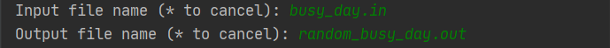
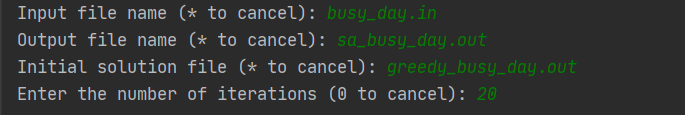

# Delivery Problem

## T02G25

### Requirements

- [Python interpreter](https://www.python.org/downloads/)
- [OR-Tools for Python](https://developers.google.com/optimization/install#python)
- [NumPy](https://numpy.org/install/)

### Run the program

To run the program, run the command ``python main.py`` on the terminal inside the src folder of the project.

### How to use

When the program starts, the following menu is displayed on the terminal:

Figure 1: Main Menu

In this menu the user can choose to:

- ``1`` Solve a problem
- ``2`` Evaluate a problem
- ``0`` Exit the program

When choosing the **Evaluate** option, the user must give the input file name, within the input folder, and the output file name, within the output folder.

If the option chosen is **Solve**, the user is presented with the menu below, where the algorithm can be chosen:

Figure 2: Algorithm Menu

After choosing the algorithm the user must give the input file name, within the input folder, and the output file name, that will be created at the output folder. The **Random**, **Greedy** and **Genetic** Algorithms only need the input and output file names. The figure below is an example of the selection of these files for running the **Random** algorithm:

Figure 3: Example for Random

For the **Hill Climbing**, **Simulated Annealing** and **Recursive Simulated Annealing** algorithms the user must also give the file name of the initial solution, within the output folder. The following image is an example of the files chosen for running the **Simulated Annealing** algorithm:

Figure 4: Example for Simulated Annealing

To run the **Recursive Simulated Annealing** algorithm the user must also give the number of iterations wanted. The following image is an example for running the **Recursive Simulated Annealing** algorithm: 

Figure 5: Example for Recursive Simulated Annealing

---

### Group Members

- Ana Teresa Cruz, up201806460@fe.up.pt
- André Nascimento, up201806461@fe.up.pt
- António Bezerra, up201806854@fe.up.pt
