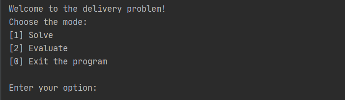
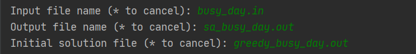

# delivery Problem

## T02G25

### Requirements

- [Python interpreter](https://www.python.org/downloads/)
- [OR-Tools for Python](https://developers.google.com/optimization/install#python)
- [NumPy](https://numpy.org/install/)

### Run the program

To run the program, run the command ``python main.py`` on the terminal inside the src folder of the project.

### How to use

When the program starts, the following menu is displayed on the terminal:

Figure 1: Main Menu

In this menu the user can choose to:

- ``1`` Solve a problem
- ``2`` Evaluate a problem
- ``0`` Exit the program

When choosing the **Solve** option, the user is presented with the menu below, where the algorithm can be chosen:

Figure 2: Algorithm Menu

In both Evaluate and Solve options the user must give the input file name, within the input folder, and the output file name, within the output folder. If Simulated Annealing is the chosen algorithm, the user must also give the file name of the initial solution, within the output folder.
The following image is an example of the files chosen for running the Simulated Algorithm:

Figure 3: Files example for Simulated Annealing

---

### Group Members

- Ana Teresa Cruz, up201806460@fe.up.pt
- André Nascimento, up201806461@fe.up.pt
- António Bezerra, up201806854@fe.up.pt
